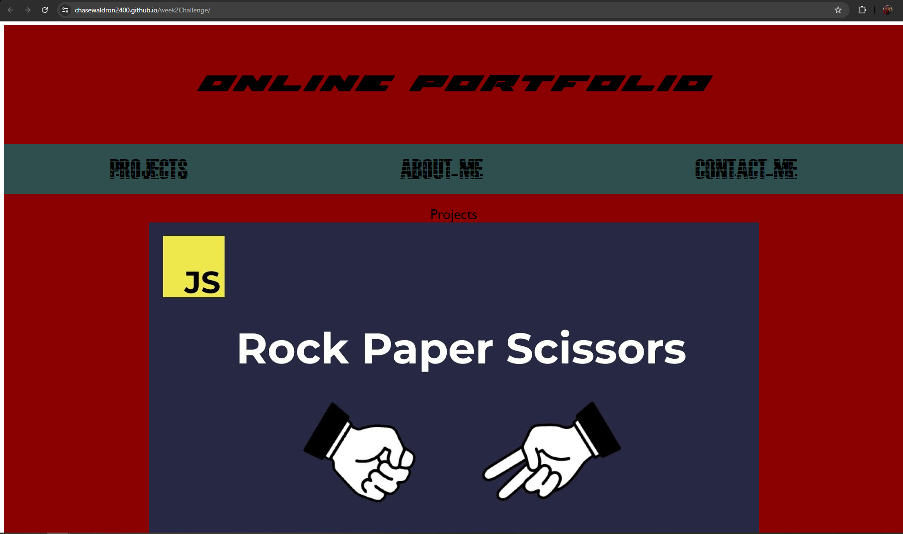

# Online Portfolio

Online portfolio built without starter code.

## Description

This project is an online portfolio built from scratch with no starter code. This can be used for the user to learn about the projects I've been doing and learn about me.

## Table of Contents

- Heading
- About Me
- Contact Me

## Installation

to install, click green code button and copy ssh key into console.

## Usage

This is for future employers or friends to see my work i've done

## Credits

https://github.com/chasewaldron2400
https://chasewaldron2400.github.io/week2Challenge/
Xpert Learning Assistant (NW Ai)

## Licsense 

None